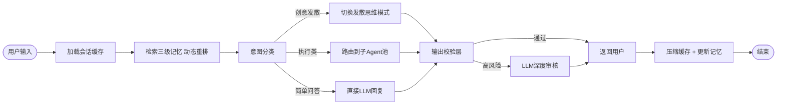

# MMI多Agent智能协作系统 —— 修订版详细设计方案

> 基于原始方案与可行性分析报告，逐模块调整后的落地级设计方案。

---

# 一、总体设计概述

## 1.1 设计目标

构建分层式多Agent智能协作系统，解决单LLM模型的五大核心痛点：

| 痛点 | 解决方案 |
|---|---|
| 上下文窗口受限 | 动态会话压缩 + 三级记忆注入 |
| 无长期记忆 | 向量语义记忆 + 结构化摘要 + 原文存储 |
| 任务混杂、无分工 | 主Agent路由 + 扁平化子Agent池 |
| 无法沉淀经验 | 人工管理技能库 + 候选技能提议 |
| 功能耦合严重 | Tool注册机制 + 模块化接口 |

## 1.2 核心设计原则

- **扁平优于层级**：最多两层Agent调度，避免延迟叠加和信息衰减
- **先人工后自动**：技能沉淀从人工管理起步，永不做全自动入库
- **每期可交付**：每个阶段产出可独立使用的完整产品
- **可观测优先**：从v1起就记录每次调用的输入/输出/延迟/Token

---

# 二、系统总体架构

## 2.1 架构图

```mermaid
graph TD
    %% 用户接入层
    A[用户] --> B[接入层]
    B --> B1[Web GUI]
    B --> B2[CLI]

    %% 主Agent核心
    B --> C[主Agent 全局调度中枢]

    %% LLM底座
    D[LLM大模型底座] -.-> C
    D -.-> I1[子Agent池]

    %% 动态会话缓存
    C --> E[动态会话缓存]
    E --> E1[首尾保留 + 中间摘要压缩]
    E --> E2[当前会话 State]

    %% 三级记忆系统
    C --> F[三级记忆系统]
    F --> F1[L1 向量语义记忆]
    F --> F2[L2 结构化摘要记忆]
    F --> F3[L3 完整原文存储]
    F1 --> F1A[动态重排序 取top-3注入]

    %% 思维模式
    C --> G[思维模式切换]
    G --> G1[标准推理]
    G --> G2[发散头脑风暴]
    G --> G3[严谨审核]

    %% 子Agent池
    C --> H[子Agent路由]
    H --> I[子Agent池]
    I --> I1[子Agent 1]
    I --> I2[子Agent 2]
    I --> I3[子Agent 3]
    I --> I4[子Agent ...]

    %% 技能库
    C --> J[全局技能库]
    J --> J1[Prompt Template]
    J --> J2[Tool 绑定]
    J --> J3[触发关键词]

    %% 输出校验
    C --> K[输出校验层]
    K --> K1[规则引擎 格式/敏感词]
    K --> K2[LLM深度审核 仅高风险]

    %% Tool注册中心
    C --> L[Tool注册中心]
    L --> L1[文件操作]
    L --> L2[数据库查询]
    L --> L3[API调用]
    L --> L4[自定义Tool ...]

    %% 可观测性
    C --> M[可观测性]
    M --> M1[Tracing追踪]
    M --> M2[调用日志]
    M --> M3[评估框架]

    %% 样式
    classDef access fill:#e6f7ff,stroke:#1890ff
    classDef core fill:#fff7e6,stroke:#faad14
    classDef memory fill:#f6ffed,stroke:#52c41a
    classDef think fill:#f9f0ff,stroke:#722ed1
    classDef agent fill:#fff2f2,stroke:#f5222d
    classDef tool fill:#f0f2f5,stroke:#8c8c8c
    classDef obs fill:#e6fffb,stroke:#13c2c2

    class A,B,B1,B2 access
    class C,D core
    class E,E1,E2,F,F1,F2,F3,F1A memory
    class G,G1,G2,G3 think
    class H,I,I1,I2,I3,I4,J,J1,J2,J3 agent
    class K,K1,K2,L,L1,L2,L3,L4 tool
    class M,M1,M2,M3 obs
```



## 2.2 与原方案的架构差异

| 模块 | 原方案 | 修订方案 | 理由 |
|---|---|---|---|
| 子Agent调度 | 主Agent → 子Agent主管 → 5个Agent | 主Agent → 直接路由子Agent池 | 减少一层LLM调用，降低延迟 |
| 记忆系统 | L1-L4 四级分类索引 | L1-L3 三级记忆 + 动态重排序 | L1/L2冗余，静态摘要失真 |
| 头脑风暴 | 独立Agent + 独立Skill | 思维模式切换，不独立部署 | 本质是推理模式，非独立服务 |
| 审核 | 独立Agent串行把关 | 规则引擎 + 按需LLM审核 | 避免审核Agent自身幻觉 + 降低延迟 |
| 技能进化 | 全自动生成 + 自动入库 | 人工管理 → 统计驱动 → 候选提议 | 全自动不可靠，会污染技能库 |
| 功能接口 | 三组抽象接口 | Tool注册中心 | 以Tool为单位，可注册可调用 |
| 可观测性 | 缺失 | Tracing + 日志 + 评估框架 | 多Agent系统必备 |

---

# 三、各模块详细设计

## 3.1 接入层

| 端 | 技术 | v1优先级 |
|---|---|---|
| Web GUI | Vue3 + Element Plus | ✅ P0 |
| CLI | Click 框架 | ✅ P0 |
| TUI | Textual | ⬜ P2（后期锦上添花） |

v1 只做 Web GUI 和 CLI，覆盖 95% 场景。

---

## 3.2 主Agent（调度中枢）

### 3.2.1 职责边界

```
主Agent职责：
  ✅ 意图识别与任务分类
  ✅ 路由到子Agent或思维模式
  ✅ 管理会话 State
  ✅ 调用记忆系统注入上下文
  ✅ 汇总结果返回用户
  ✅ 触发输出校验

主Agent不做的：
  ❌ 不再做子Agent的任务再拆解（子Agent自己拆）
  ❌ 不做具体业务逻辑执行
```

### 3.2.2 LangGraph 流程



### 3.2.3 意图分类策略

用轻量 prompt 做一轮分类，而非单独起一个 Agent：

| 意图类别 | 处理方式 | 示例 |
|---|---|---|
| 简单问答 | 主Agent直接回复 | "Python的list和tuple有什么区别" |
| 创意发散 | 切换到头脑风暴思维模式 | "帮我想5个产品功能点子" |
| 执行类 | 路由到子Agent池 | "帮我审查这段代码" |
| 工具调用 | 路由到对应Tool | "读取data.csv并统计行数" |

---

## 3.3 动态会话缓存

### 3.3.1 压缩策略

```
窗口上限: 8000 token（可根据模型上下文窗口调整）
保留策略:
  - 首部保留: 前3轮对话原样保留（含初始需求）
  - 尾部保留: 最近3轮对话原样保留
  - 中部压缩: 其余轮次由LLM逐轮摘要为单句，丢弃原文
```

### 3.3.2 State 结构（LangGraph TypedDict）

```python
class AgentState(TypedDict):
    session_id: str
    user_id: str
    messages: list[dict]          # 当前窗口内的消息
    compressed_history: str       # 被压缩的历史摘要
    retrieved_memories: list[dict] # 检索到的记忆片段
    current_intent: str           # 当前意图分类
    active_agent: str             # 当前路由到的子Agent ID
    pending_output: str           # 待校验的输出
    validation_result: str        # 校验结果: pass / flag / block
```

---

## 3.4 三级记忆系统（替代原四级）

### 3.4.1 结构

| 层级 | 存储内容 | 检索方式 |
|---|---|---|
| **L1 向量语义记忆** | 对话切片的 embedding 向量 | FAISS/Milvus 语义相似度检索 |
| **L2 结构化摘要记忆** | LLM生成的摘要：`{主题, 决策, 关键结论, 待办}` | SQL 查询（通过 memory_id 关联） |
| **L3 完整原文存储** | 原始对话全文 | 按 memory_id 加载，不参与检索 |

### 3.4.2 检索流程

```
1. 用户当前输入 → embedding
2. FAISS top-10 语义相似匹配 (L1)
3. 加载对应 top-10 的结构化摘要 (L2)
4. LLM 动态重排序：根据当前上下文评估 10 条摘要的相关性，选 top-3
5. top-3 的摘要 + memory_id 注入 Agent 上下文
6. 如用户追问细节 → 通过 memory_id 加载 L3 原文
```

### 3.4.3 与四级方案对比

| 维度 | 原四级方案 | 三级方案 |
|---|---|---|
| 索引数量 | 3套（标题 + 关键词 + 向量） | 1套（向量） |
| 检索延迟 | 需合并3套索引结果，复杂度高 | 单路检索 + 重排序 |
| 维护成本 | 高（多表同步更新） | 低（单表写入） |
| 检索质量 | 静态分类可能遗漏 | 动态重排序更贴合当前上下文 |

---

## 3.5 思维模式切换（替代独立头脑风暴/审核Agent）

### 3.5.1 设计

不再部署独立的"头脑风暴Agent"和"审核专员Agent"。改为在主Agent内部通过 **system prompt 动态切换** 实现推理模式变化：

| 思维模式 | System Prompt 特征 | 触发场景 |
|---|---|---|
| **标准推理** | 客观、准确、简洁 | 默认模式 |
| **发散头脑风暴** | 鼓励多角度、不急于收敛、量大优先 | 创意生成、方案构思 |
| **严谨审核** | 逐条检查、关注边界、质疑假设 | 高风险输出二次核查 |

### 3.5.2 沉淀机制

头脑风暴中产生的有效思维框架（如"SWOT分析法""六顶思考帽"）沉淀为 Skill 库中的 prompt template，供后续同类任务复用。

---

## 3.6 子Agent池（替代子Agent集群）

### 3.6.1 设计

```
主Agent → 意图分类 → 直接路由到对应子Agent
                         ↓
              子Agent: { id, name, system_prompt, tools[], skills[] }
```

每个子Agent是独立注册的 prompt + tool set 组合，按业务需求动态增减。

### 3.6.2 Agent 注册结构

```python
@register_agent
class CodeReviewAgent:
    id = "code_review"
    name = "代码审查"
    system_prompt = "你是资深代码审查专家..."
    tools = ["read_file", "run_linter", "search_code"]
    skills = ["python_best_practices", "security_checklist"]
    trigger_keywords = ["审查代码", "code review", "检查代码"]
```

### 3.6.3 v1 建议注册的Agent

| Agent | 职责 | 优先级 |
|---|---|---|
| CodeReviewAgent | 代码审查、安全扫描 | P0 |
| DocAgent | 文档生成、翻译、总结 | P1 |
| DataAgent | 数据分析、SQL生成 | P1 |
| 按业务需求新增 | — | P2 |

> 不预设固定数量，按需注册。

---

## 3.7 全局技能库（Skill Library）

### 3.7.1 Skill 定义

```json
{
  "skill_id": "uuid",
  "name": "Python代码审查",
  "version": 1,
  "type": "system_prompt | tool_binding | workflow",
  "content": "你是一个资深Python代码审查专家。请按以下维度审查代码：\n1. 安全性\n2. 性能\n3. 可读性\n4. 错误处理",
  "trigger_keywords": ["审查代码", "code review", "检查Python代码"],
  "bound_tools": ["read_file", "run_linter"],
  "bound_agents": ["code_review"],
  "created_by": "admin",
  "status": "active | deprecated",
  "usage_count": 0,
  "positive_feedback_rate": 0.0,
  "created_at": "2026-06-03T00:00:00Z",
  "updated_at": "2026-06-03T00:00:00Z"
}
```

### 3.7.2 技能生命周期

```
创建（人工） → 发布 → 使用统计 → 人工迭代 → 新版本发布
                                    ↘ 弃用（使用率低/反馈差）
```

### 3.7.3 候选技能提议（v3+）

系统可**提议**新技能，格式：

> "我注意到你最近 12 次代码审查后都手动运行了 `pytest`，是否要将『代码审查后自动运行测试』固化为一个技能？"

用户确认后才入库，**绝不自动入库**。

---

## 3.8 输出校验层（替代独立审核Agent）

### 3.8.1 分层设计

```
输出数据 → [第一层] 规则引擎 → 通过 → 直接返回
                    ↓
                 触发规则（高风险标记）
                    ↓
              [第二层] LLM深度审核 → 修正后返回
```

### 3.8.2 规则引擎校验项

| 规则 | 类型 | 动作 |
|---|---|---|
| 包含禁止关键词 | 安全 | **拦截**，返回预设安全提示 |
| 输出为空或过短 | 质量 | **标记**，提示Agent重试 |
| 格式不符合预期 | 结构 | **标记**，尝试自动修复 |
| 置信度标记（Agent自评<0.7） | 质量 | **送深度审核** |

### 3.8.3 深度审核

仅当规则引擎标记为高风险时，才调用 LLM 以严谨审核思维模式做二次检查。此时额外消耗一次 LLM 调用，但概率应控制在 <20% 的输出上。

---

## 3.9 Tool 注册中心（替代抽象功能接口）

### 3.9.1 Tool 结构

```python
@tool
def read_data_file(path: str) -> str:
    """读取指定路径的数据文件内容。用于读取CSV、JSON等数据文件。"""
    return Path(path).read_text(encoding="utf-8")

@tool
def query_database(sql: str) -> list[dict]:
    """执行SQL查询并返回结果。仅支持SELECT语句。"""
    # 安全校验：仅允许SELECT
    ...
```

### 3.9.2 Tool 自动发现

```
tools/
  file_ops.py       → read_file, write_file, list_dir
  database.py       → query_db, list_tables
  external_api.py   → call_third_party
  custom.py         → 按需添加
```

启动时自动扫描 `tools/` 目录，注册所有带 `@tool` 装饰器的函数。

---

## 3.10 可观测性（新增模块）

### 3.10.1 调用追踪

每次 Agent 调用记录：

```python
{
    "trace_id": "uuid",
    "session_id": "uuid",
    "agent_id": "main | code_review | ...",
    "step": "classify | route | execute | validate",
    "input": "...",
    "output": "...",
    "latency_ms": 1234,
    "token_usage": { "input": 500, "output": 200 },
    "timestamp": "2026-06-03T00:00:00Z",
    "error": null
}
```

### 3.10.2 评估框架

50-100 个典型场景的测试集：

```python
EVAL_CASES = [
    {
        "input": "帮我检查 app.py 的安全性",
        "expected_agent": "code_review",
        "expected_contains": ["安全", "漏洞", "SQL注入"],
    },
    ...
]
```

每次改动后跑评估，输出通过率。

---

## 3.11 Fallback 机制（新增模块）

| 场景 | Fallback 行为 |
|---|---|
| 意图分类无匹配 | 走默认标准推理模式 |
| 子Agent执行失败 | 重试一次 → 仍失败则告知用户并给出已知信息 |
| LLM 调用超时 | 降级用轻量模型或用缓存结果 |
| 所有路径都不通 | 输出："抱歉，我当前无法处理这个请求。以下是已知信息：..." |

---

# 四、核心技术栈（修订）

| 类别 | 选型 | v1 是否必需 |
|---|---|---|
| 语言 | Python 3.10+ | ✅ |
| Web框架 | FastAPI | ✅ |
| Agent编排 | LangGraph | ✅ |
| LLM SDK | LangChain（仅用其Tool/Model抽象） | ✅ |
| 向量数据库 | FAISS | ✅ (v1) |
| 业务数据库 | SQLite (v1) → MySQL 8.0 (v2+) | ✅ |
| 缓存 | Redis | P1 (v1可用内存缓存) |
| 前端 | Vue3 + Element Plus | ✅ |
| CLI | Click | ✅ |
| 任务队列 | asyncio (v1) → Celery (仅在必须时) | ❌ (v1不需要) |
| 可观测性 | LangFuse / 自建日志 | ✅ |
| LLM | Qwen / DeepSeek / GLM 双模式 | ✅ |

---

# 五、数据库设计（修订）

## 5.1 用户表 (users)

| 字段 | 类型 | 说明 |
|---|---|---|
| id | UUID PK | |
| username | VARCHAR(64) | |
| role | VARCHAR(16) | admin / user |
| created_at | TIMESTAMP | |
| status | VARCHAR(8) | active / disabled |

## 5.2 会话表 (sessions)

| 字段 | 类型 | 说明 |
|---|---|---|
| id | UUID PK | |
| user_id | FK → users | |
| state | JSON | 当前 LangGraph State 快照 |
| compressed_summary | TEXT | 被压缩掉的历史摘要 |
| message_count | INT | |
| created_at | TIMESTAMP | |
| updated_at | TIMESTAMP | |

## 5.3 记忆表 (memories) —— 三级合一

| 字段 | 类型 | 说明 |
|---|---|---|
| id | UUID PK | |
| user_id | FK → users | |
| session_id | FK → sessions | |
| vector | VECTOR(1536) | L1 向量语义索引 |
| summary_title | VARCHAR(256) | L2 结构化摘要-主题 |
| summary_decision | TEXT | L2 结构化摘要-决策 |
| summary_conclusion | TEXT | L2 结构化摘要-结论 |
| summary_todos | TEXT | L2 结构化摘要-待办 |
| raw_content | TEXT | L3 完整原文 |
| created_at | TIMESTAMP | |

## 5.4 技能表 (skills)

| 字段 | 类型 | 说明 |
|---|---|---|
| id | UUID PK | |
| name | VARCHAR(128) | |
| version | INT | |
| type | VARCHAR(32) | system_prompt / tool_binding / workflow |
| content | TEXT | Prompt文本或配置 |
| trigger_keywords | JSON | 触发关键词列表 |
| bound_tools | JSON | 绑定的 Tool ID 列表 |
| bound_agents | JSON | 适用的 Agent ID 列表 |
| status | VARCHAR(16) | active / deprecated |
| usage_count | INT | |
| positive_rate | FLOAT | |
| created_by | VARCHAR(64) | |
| created_at | TIMESTAMP | |
| updated_at | TIMESTAMP | |

## 5.5 调用追踪表 (traces) —— 新增

| 字段 | 类型 | 说明 |
|---|---|---|
| id | UUID PK | |
| session_id | FK → sessions | |
| agent_id | VARCHAR(64) | main / code_review / ... |
| step | VARCHAR(32) | classify / route / execute / validate |
| input_summary | TEXT | 输入摘要（不存原文防泄露） |
| output_summary | TEXT | 输出摘要 |
| latency_ms | INT | |
| token_input | INT | |
| token_output | INT | |
| error | TEXT | nullable |
| created_at | TIMESTAMP | |

---

# 六、核心API接口（修订）

## 6.1 会话接口

| 方法 | 路径 | 说明 |
|---|---|---|
| POST | /api/sessions | 创建新会话 |
| POST | /api/sessions/{id}/chat | 发送消息，触发主Agent |
| GET | /api/sessions/{id} | 获取会话历史 |

## 6.2 记忆接口

| 方法 | 路径 | 说明 |
|---|---|---|
| GET | /api/memories?q=关键词 | 检索历史记忆 |
| GET | /api/memories/{id} | 获取记忆原文（L3） |
| DELETE | /api/memories/{id} | 删除某条记忆 |

## 6.3 Agent接口

| 方法 | 路径 | 说明 |
|---|---|---|
| GET | /api/agents | 列出已注册的子Agent |
| POST | /api/agents/{id}/invoke | 直接调用指定Agent（调试用） |

## 6.4 技能接口

| 方法 | 路径 | 说明 |
|---|---|---|
| GET | /api/skills | 列出技能库 |
| POST | /api/skills | 人工创建技能 |
| PUT | /api/skills/{id} | 更新技能 |
| POST | /api/skills/{id}/deprecate | 弃用技能 |

## 6.5 可观测性接口

| 方法 | 路径 | 说明 |
|---|---|---|
| GET | /api/traces?session_id= | 查看调用追踪 |
| GET | /api/stats | 系统使用统计 |

---

# 七、部署分期规划（修订）

## 一期：MVP —— 能对话、能调工具的单一Agent

**目标：** 跑通主链路

| 模块 | 内容 |
|---|---|
| 接入层 | Web GUI（Vue3单页） + CLI |
| 主Agent | 意图分类（3类：问答/创意/执行） + LLM调用 |
| 会话 | 基础会话管理，窗口内全量保留（不压缩，限制20轮） |
| Tool | 3-5个硬编码工具（读文件、查天气、简单计算） |
| 输出 | 直接返回，无校验层 |
| 数据存储 | SQLite（单文件，零运维） |
| 可观测性 | 基础日志 + 调用追踪表 |

**验收标准：** 能完成基础问答和工具调用，端到端延迟 < 3s。

---

## 二期：记忆 —— 有长期记忆的Agent

**目标：** 跨会话记住用户

| 模块 | 内容 |
|---|---|
| 记忆 | 三级记忆系统（FAISS向量 + 结构化摘要 + 原文存储） |
| 会话缓存 | 压缩算法上线（首尾保留+中间摘要） |
| 记忆注入 | 检索 → 动态重排序 → top-3 注入上下文 |
| 评估框架 | 50个基础测试用例 |
| 数据库 | 从 SQLite 迁移到 MySQL 8.0 + Redis 缓存 |
| 前端 | 记忆浏览面板 |

**验收标准：** 新会话中能引用历史对话内容，记忆检索延迟 < 500ms。

---

## 三期：多Agent —— 有分工的Agent系统

**目标：** 不同任务走不同Agent

| 模块 | 内容 |
|---|---|
| 子Agent池 | CodeReview、Doc、Data 等 Agent 注册与路由 |
| 思维模式 | 发散/标准/严谨 三模式切换 |
| 技能库 | 人工创建、发布、统计 |
| 输出校验 | 规则引擎（格式/敏感词），标记高风险 |
| 前端 | 多Agent结果展示 |

**验收标准：** 路由准确率 > 90%，校验层拦截率合理（不误杀、不漏杀）。

---

## 四期：进化 —— 数据驱动的迭代系统

**目标：** 越用越好

| 模块 | 内容 |
|---|---|
| 技能统计 | 使用率、采纳率看板 |
| 候选提议 | 技能提议生成（需人工确认） |
| 深度审核 | LLM审核上线（仅高风险触发） |
| 第三方对接 | Tool注册机制支持外部API |
| 性能调优 | 全面压测与优化 |

**验收标准：** 候选提议准确率 > 70%，整体可用率 > 99.5%。

---

# 八、风险控制

| 风险 | 等级 | 缓解措施 |
|---|---|---|
| 多Agent路由错误 | 中 | 意图分类 prompt 持续优化 + 评估用例覆盖 |
| 记忆检索质量差 | 中 | 动态重排序 + A/B 测试不同 embedding 模型 |
| LLM 幻觉 | 高 | 分层校验 + 严格 fallback + 不做全自动决策 |
| 技能库污染 | 高 | 人工审核入库 + 技能版本管理 + 使用率淘汰 |
| 私有化部署算力不足 | 中 | 适配 1.5B/7B 轻量模型 + 量化为 INT4/INT8 |

---

# 九、附录：与原方案的关键差异速查

| # | 原方案 | 修订方案 |
|---|---|---|
| 1 | L1-L4 四级记忆 | L1-L3 三级记忆 + 动态重排序 |
| 2 | 子Agent主管 + 固定5个Agent | 主Agent直接路由 + 动态注册 |
| 3 | 头脑风暴Agent（独立） | 发散思维模式（prompt切换） |
| 4 | 审核专员Agent（独立） | 规则引擎 + 按需LLM审核 |
| 5 | 技能全自动进化 | 人工管理 → 统计 → 候选提议（需确认） |
| 6 | 三组抽象功能接口 | Tool注册中心 |
| 7 | 无可观测性设计 | Tracing + 日志 + 评估框架 |
| 8 | 无Fallback设计 | 分级降级策略 |
| 9 | Celery任务队列（v1） | asyncio（v1），Celery延后 |
| 10 | TUI三端(v1) | Web+CLI(v1)，TUI延后 |

---

> 版本：v1.0
> 生成时间：2026-06-03
> 基于：《MMI多Agent智能协作系统详细设计方案》+《可行性落地分析报告》
