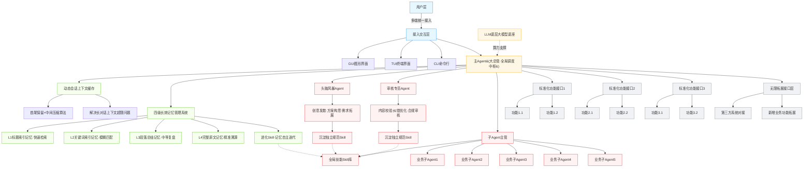

```mermaid wrap
graph TD
    %% 顶层：用户接入层
    A[用户层] -- 多端统一接入 --> B[接入交互层]
    B --> B1[GUI图形界面]
    B --> B2[TUI终端界面]
    B --> B3[CLI命令行]

    %% 核心调度层
    B --> C[主Agent&#40;大总管·全局调度中枢&#41;]
    D[LLM底层大模型底座] -.算力支撑.-> C

    %% 六大核心能力模块
    %% 1.动态会话缓存模块
    C --> E[动态会话上下文缓存]
    E --> E1[首尾保留+中间压缩算法]
    E --> E2[解决长对话上下文超限问题]

    %% 2.四级分级记忆模块
    C --> F[四级长效记忆管理系统]
    F --> F1[L1标题索引记忆·快速检索]
    F --> F2[L2关键词索引记忆·模糊匹配]
    F --> F3[L3段落总结记忆·中等复盘]
    F --> F4[L4完整原文记忆·精准溯源]
    F --> F5[进化Skill·记忆自主迭代]

    %% 3.头脑风暴专项Agent
    C --> G[头脑风暴Agent]
    G --> G1[创意发散·方案构思·需求拓展]
    G1 --> G2[沉淀独立规范Skill]

    %% 4.审核专员专项Agent
    C --> H[审核专员Agent]
    H --> H1[内容校验·纠错优化·合规审核]
    H1 --> H2[沉淀独立规范Skill]

    %% 5.子Agent集群执行系统
    C --> I[子Agent主管]
    I --> I1[全局技能Skill库]
    I --> I2[业务子Agent1]
    I --> I3[业务子Agent2]
    I --> I4[业务子Agent3]
    I --> I5[业务子Agent4]
    I --> I6[业务子Agent5]

    %% 技能进化闭环：全渠道技能回流技能库
    F5 -.-> I1
    G2 -.-> I1
    H2 -.-> I1

    %% 6.标准化功能接口模块
    C --> J[标准化功能接口1]
    J --> J1[功能1.1]
    J --> J2[功能1.2]

    C --> K[标准化功能接口2]
    K --> K1[功能2.1]
    K --> K2[功能2.2]

    C --> L[标准化功能接口3]
    L --> L1[功能3.1]
    L --> L2[功能3.2]

    %% 底层拓展层
    C --> M[无限拓展接口层]
    M --> M1[第三方系统对接]
    M --> M2[新增业务功能拓展]

    %% 样式统一优化
    classDef userLayer fill:#e6f7ff,stroke:#1890ff
    classDef coreLayer fill:#fff7e6,stroke:#faad14
    classDef memoryLayer fill:#f6ffed,stroke:#52c41a
    classDef agentLayer fill:#fff2f2,stroke:#f5222d
    classDef extendLayer fill:#f0f2f5,stroke:#8c8c8c

    class A,B userLayer
    class C,D coreLayer
    class E,F,F1,F2,F3,F4,F5 memoryLayer
    class G,H,I,G1,G2,H1,H2,I1,I2,I3,I4,I5,I6 agentLayer
    class J,K,L,M,J1,J2,K1,K2,L1,L2,M1,M2 extendLayer
    
```

