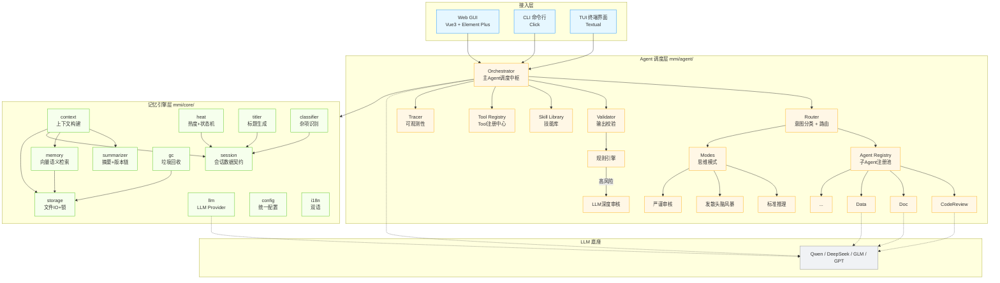

# MMI —— 统一多模态智能体系统架构设计

> MMI = Multimodal Intelligence（多模态智能体）
> 合并 ctrim 记忆引擎 + MMI 多Agent调度，单一代码库，单一交付物。

---

# 一、统一架构全景图



---

# 二、目录结构

```
mmi/
├── core/                       # 记忆引擎层（来自 ctrim，重组织）
│   ├── __init__.py             # 公开 API 导出
│   ├── session.py              # Session / SessionMeta dataclass，ULID，状态枚举
│   ├── storage.py              # .session.md 文件 IO，原子写，文件锁，turn 解析
│   ├── heat.py                 # 热度公式，四态状态机推导
│   ├── context.py              # 上下文构建（原 loader.py，更名）
│   ├── summarizer.py           # 摘要生成，版本链，后台线程
│   ├── memory.py               # [新建] 向量语义记忆，embedding + FTS5 双路检索
│   ├── search.py               # 关键词检索（TF + fuzzy，后期升级 FTS5）
│   ├── gc.py                   # 垃圾回收（trash TTL，zombie/cold 清理）
│   ├── titler.py               # 会话标题生成（LLM + 启发式 fallback）
│   ├── classifier.py           # 杂项识别（规则 + LLM 混合）
│   ├── llm.py                  # LLM Provider 抽象（Echo / OpenAI / stream_chat）
│   ├── config.py               # 统一配置 ~/.mmi/config.toml
│   ├── i18n.py                 # 双语 t() 函数
│   ├── paths.py                # ~/.mmi/ 路径解析
│   └── locales/
│       ├── zh-CN.json
│       └── en-US.json
│
├── agent/                      # Agent 调度层（新建）
│   ├── __init__.py
│   ├── orchestrator.py         # 主Agent 调度中枢，单次对话完整流程
│   ├── router.py               # 意图分类 + 子Agent路由分发
│   ├── registry.py             # 子Agent注册表，动态注册/发现
│   ├── base.py                 # BaseAgent 抽象类
│   ├── builtin/                # 内置子Agent
│   │   ├── __init__.py
│   │   ├── code_review.py      # 代码审查
│   │   ├── doc.py              # 文档生成
│   │   └── data.py             # 数据分析
│   ├── modes.py                # 思维模式切换（标准/头脑风暴/审核）
│   ├── validate.py             # 输出校验层（规则引擎 + LLM深度审核）
│   ├── skill.py                # 技能库管理（CRUD + 统计）
│   ├── tools.py                # Tool 注册中心（@tool 装饰器自动发现）
│   └── trace.py                # 调用追踪 + 评估框架
│
├── cli.py                      # 统一 CLI 入口（typer，管理全部命令）
├── tui/                        # TUI 终端界面（textual）
│   ├── __init__.py
│   ├── app.py
│   ├── commands.py
│   ├── history.py
│   ├── parse_blocks.py
│   ├── theme_css.py
│   ├── theme.tcss
│   ├── screens/
│   │   ├── list.py
│   │   ├── chat.py
│   │   └── search.py
│   └── widgets/
│       ├── chat_log.py
│       ├── header_bar.py
│       ├── hint_bar.py
│       ├── slash_menu.py
│       └── status_bar.py
│
├── tools/                      # 诊断/维护工具
│   └── doctor.py               # mmi doctor 诊断命令
│
├── skills/                     # 内置技能库
│   └── code_review/
│       └── SKILL.md
│
├── tests/                      # 测试（继承 ctrim 351 测试 + MMI 新增）
│   ├── test_session.py
│   ├── test_storage.py
│   ├── test_heat.py
│   ├── test_context.py
│   ├── test_summarizer.py
│   ├── test_search.py
│   ├── test_memory.py          # [新建]
│   ├── test_orchestrator.py    # [新建]
│   ├── test_router.py          # [新建]
│   ├── test_validate.py        # [新建]
│   └── ...
│
├── pyproject.toml
├── README.md
└── .gitignore
```

---

# 三、模块职责详解

## 3.1 记忆引擎层（mmi/core/）

### session.py —— 会话数据契约

```python
class SessionState(str, Enum):
    ACTIVE = "active"
    WARM   = "warm"
    COLD   = "cold"
    ZOMBIE = "zombie"

@dataclass
class SessionMeta:
    session_id: str          # ULID，26字符时序可排序
    title: str
    state: SessionState
    heat: float
    access_count: int
    created_at: str          # UTC ISO-8601
    updated_at: str
    last_access: str
    summary: str
    summary_history: str     # 摘要版本链
    turn_count: int
    cold_since: str          # 进入 cold 态的时间
    classifier: str          # 杂项识别结果
    language: str            # zh-CN / en-US

@dataclass
class Session:
    meta: SessionMeta
    body: str                # Markdown 对话正文
```

### storage.py —— 文件 IO

```
存储位置: ~/.mmi/sessions/{active,trash}/
文件格式: {session_id}.session.md
  → YAML frontmatter（SessionMeta 序列化）
  → Markdown body（## date\n\n**User:** ...\n\n**Assistant:** ...）

原子写: .tmp → os.replace()
并发锁: portalocker 排他锁，timeout 10s
追加: append_turn() 始终追加，不重写历史
```

### heat.py —— 热度生命周期

```
heat = access_count × 1.0 + recency_bonus - age_penalty

recency_bonus: 1天内+10, 7天+5, 30天+1
age_penalty: 每30天-1

状态推导:
  heat ≥ 10    → active
  heat ≥ 5     → warm
  其他          → cold
  cold 持续90天 → zombie
```

### context.py —— 上下文构建（核心）

```
构建流程:
  1. 读取 session 文件和 meta
  2. 取: system_prompt
  3. 取: summary（摘要，不可丢弃）
  4. 调 memory.py 向量检索 top-K 历史记忆
  5. 取: 命中段（当前 session 内关键词匹配）
  6. 取: 最近 N 轮对话（默认10轮）
  7. 拼成 OpenAI messages 格式
  8. 估算 token，超过上限按优先级截断

截断优先级: current_user > 历史命中段 > 最近轮 > 摘要（永不丢弃）
```

### memory.py —— 向量语义记忆（新建）

```
入库:
  对话结束 → LLM 生成结构化摘要
    { 主题, 决策, 关键结论, 待办事项 }
  → embedding 模型生成向量 → 存入 SQLite + FAISS
  → 原文保留在 .session.md（L3）

检索:
  用户输入 → embedding
  → FAISS 语义匹配 top-20
  → 加载对应结构化摘要
  → LLM 动态重排序（结合当前上下文评估相关性）
  → 取 top-3 注入 context

双路: FTS5 关键词 + vector 语义 → 合并去重 → 重排序
```

### summarizer.py —— 摘要系统

```
触发条件（三选一）:
  - 自上次摘要 ≥ 20 轮
  - 自上次摘要 ≥ 5000 字符
  - 距上次摘要 > 24h 且有 ≥ 5 轮新增

执行: 后台线程 schedule_summary_update()，不阻塞 chat
版本链: summary_history 保留所有历史摘要
```

### gc.py —— 垃圾回收

```
trash TTL: 7 天 → 硬删除
zombie: 检测到直接删除
cold 超期: 移入 trash（默认30天）
dry_run: 预览模式
分层命令: gc --gc-only cold|zombie|trash
```

---

## 3.2 Agent 调度层（mmi/agent/）

### orchestrator.py —— 主Agent调度中枢

这是整个系统唯一的入口。单次对话的完整流程：

```python
class Orchestrator:
    def __init__(self, llm: LLMProvider):
        self.router = Router()
        self.registry = AgentRegistry()
        self.validator = Validator()
        self.tracer = Tracer()

    async def chat(self, session_id: str, user_input: str) -> ChatResult:
        # 1. 构建上下文（core/context.py）
        messages = build_context(session_id, user_input)

        # 2. 意图分类（agent/router.py）
        intent = await self.router.classify(user_input, messages)

        # 3. 路由分发
        if intent.type == "creative":
            mode = ThinkingMode.BRAINSTORM
            reply = await self._direct_llm(messages, mode)
        elif intent.type == "execute":
            agent = self.registry.match(intent)
            reply = await agent.run(messages)
        else:
            reply = await self._direct_llm(messages, ThinkingMode.STANDARD)

        # 4. 输出校验（agent/validate.py）
        validation = await self.validator.check(user_input, reply)
        if validation.flagged:
            reply = await self._deep_audit(reply, messages)

        # 5. 持久化（core/storage.py）
        append_turn(session_id, user_input, reply)
        update_access(session_id)
        schedule_summary_update(session_id)  # 后台非阻塞

        # 6. 追踪（agent/trace.py）
        self.tracer.record(session_id, intent, reply, validation)

        return ChatResult(reply=reply)
```

### router.py —— 意图分类 + 路由

```python
class IntentType(str, Enum):
    QA        = "qa"         # 简单问答 → 主Agent直接回复
    CREATIVE  = "creative"   # 创意生成 → 头脑风暴模式
    EXECUTE   = "execute"    # 执行类 → 路由到子Agent
    TOOL      = "tool"       # 工具调用 → Tool注册中心

class Router:
    def classify(self, user_input, context) -> Intent:
        # 轻量 prompt 做一轮分类，不走重 LLM
        ...

    def route(self, intent: Intent) -> Agent | ThinkingMode | Tool:
        if intent.type == IntentType.EXECUTE:
            return self.registry.match(intent)
        if intent.type == IntentType.CREATIVE:
            return ThinkingMode.BRAINSTORM
        ...
```

### registry.py —— 子Agent注册表

```python
class AgentRegistry:
    def register(self, agent: BaseAgent): ...
    def match(self, intent: Intent) -> BaseAgent: ...
    def list_all(self) -> list[BaseAgent]: ...

@dataclass
class AgentMeta:
    id: str
    name: str
    description: str
    trigger_keywords: list[str]
    system_prompt: str
    tools: list[str]           # 绑定的 Tool ID
    skills: list[str]          # 绑定的 Skill ID
```

### base.py —— BaseAgent 抽象

```python
class BaseAgent(ABC):
    id: str
    name: str
    system_prompt: str
    tools: list[str]

    @abstractmethod
    async def run(self, messages: list[dict]) -> str: ...
```

### modes.py —— 思维模式切换

```python
class ThinkingMode(str, Enum):
    STANDARD   = "standard"    # 客观、准确、简洁
    BRAINSTORM = "brainstorm"  # 鼓励发散、量大优先、不急于收敛
    AUDIT      = "audit"       # 逐条检查、质疑假设、关注边界

# 实现: 同一 LLM，不同 system_prompt
MODE_PROMPTS = {
    ThinkingMode.STANDARD:   "你是 MMI 智能助手，请客观准确地回答问题。",
    ThinkingMode.BRAINSTORM: "你是创意专家，请从多角度发散思考，先追求数量再追求质量...",
    ThinkingMode.AUDIT:      "你是审核专家，请逐条审查以下内容，关注逻辑漏洞和事实错误...",
}
```

### validate.py —— 输出校验层

```
第一层：规则引擎（零延迟）
  - 敏感词列表匹配 → 拦截
  - 输出为空/过短 → 标记重试
  - 格式校验（JSON/markdown 结构） → 自动修复
  - Agent 自评置信度 < 0.7 → 标记高风险

第二层：LLM 深度审核（仅高风险触发，概率<20%）
  - 以 AUDIT 模式重新审查输出
  - 对比输入需求 vs 输出的完整性
  - 修正后返回
```

### skill.py —— 技能库

```python
@dataclass
class Skill:
    id: str
    name: str
    version: int
    type: str               # system_prompt | tool_binding | workflow
    content: str            # Prompt 文本或配置
    trigger_keywords: list[str]
    bound_tools: list[str]
    bound_agents: list[str]
    status: str             # active | deprecated
    usage_count: int
    positive_rate: float

class SkillLibrary:
    def create(self, skill: Skill) -> Skill: ...     # 人工创建
    def update(self, id: str, skill: Skill): ...     # 人工更新
    def deprecate(self, id: str): ...                # 人工弃用
    def match(self, user_input: str) -> list[Skill]: ...  # 触发匹配
    def propose(self) -> list[str]: ...              # 候选技能提议（v3）
```

### tools.py —— Tool 注册中心

```python
import functools

_TOOL_REGISTRY: dict[str, ToolDef] = {}

@dataclass
class ToolDef:
    name: str
    description: str
    parameters: dict         # JSON Schema
    handler: Callable

def tool(func):
    """装饰器：自动注册为 Tool"""
    _TOOL_REGISTRY[func.__name__] = ToolDef(
        name=func.__name__,
        description=func.__doc__ or "",
        parameters={},  # 从 type hints 推断
        handler=func
    )
    @functools.wraps(func)
    def wrapper(*args, **kwargs):
        return func(*args, **kwargs)
    return wrapper

# 使用示例
@tool
def read_file(path: str) -> str:
    """读取指定路径的文件内容"""
    return Path(path).read_text(encoding="utf-8")
```

### trace.py —— 可观测性

```python
@dataclass
class TraceRecord:
    trace_id: str
    session_id: str
    agent_id: str            # main | code_review | doc | ...
    step: str                # classify | route | execute | validate
    input_summary: str
    output_summary: str
    latency_ms: int
    token_input: int
    token_output: int
    error: str | None
    timestamp: str

class Tracer:
    def record(self, record: TraceRecord): ...
    def query(self, session_id: str) -> list[TraceRecord]: ...
```

---

# 四、数据流：一次完整对话

```
用户输入 "帮我审查 app.py 的安全性"
         │
         ▼
┌─ Orchestrator.chat() ─────────────────────────────────────┐
│                                                            │
│  ① context.build(session_id, user_input)                  │
│     ├── core/storage: 读 .session.md                      │
│     ├── core/memory: FAISS 语义检索 top-20                │
│     ├── core/memory: LLM 动态重排 → top-3                │
│     ├── core/context: 拼 summary + 命中段 + 最近10轮      │
│     └── → messages = [system, ..., user]                  │
│                                                            │
│  ② router.classify(user_input, messages)                  │
│     └── → Intent(type=EXECUTE, target="code_review")      │
│                                                            │
│  ③ registry.match(intent)                                 │
│     └── → CodeReviewAgent(system_prompt=..., tools=[...]) │
│                                                            │
│  ④ agent.run(messages)                                    │
│     ├── LLM: "你是代码审查专家..."                        │
│     ├── Tool: read_file("app.py")                         │
│     ├── Tool: search_code("SQL injection")                │
│     └── → reply = "发现3个问题: ..."                      │
│                                                            │
│  ⑤ validator.check(user_input, reply)                     │
│     ├── 规则引擎: 无敏感词，格式正常                      │
│     ├── 置信度: 0.85 → 不触发深度审核                     │
│     └── → ValidationResult(flagged=False)                 │
│                                                            │
│  ⑥ storage.append_turn(session_id, user_input, reply)     │
│     └── 原子写 .session.md                                │
│                                                            │
│  ⑦ heat.compute(access_count++, now)                      │
│     └── 更新 heat 值 + state                              │
│                                                            │
│  ⑧ summarizer.schedule(session_id)  # 后台线程             │
│     └── 检查触发条件，按需生成新摘要                       │
│                                                            │
│  ⑨ tracer.record(trace)                                   │
│                                                            │
│  ⑩ → 返回 reply 给用户                                    │
└────────────────────────────────────────────────────────────┘
```

---

# 五、CLI 命令一览（统一入口）

```bash
# === 会话管理 ===
mmi new "标题"              # 创建新会话
mmi list                    # 列出会话（按热度排序）
mmi list --state cold       # 按状态过滤
mmi chat <session_id>       # 进入对话模式
mmi rename <id> <新标题>    # 重命名
mmi info <id>               # 查看会话详情
mmi archive <id>            # 归档
mmi delete <id>             # 删除

# === 记忆 ===
mmi memory search "关键词"  # 检索历史记忆
mmi memory show <id>        # 查看记忆详情

# === Agent ===
mmi agent list              # 列出已注册的子Agent
mmi agent invoke <id>       # 直接调用指定Agent（调试）

# === 技能 ===
mmi skill list              # 列出技能库
mmi skill create            # 创建技能（交互式）
mmi skill show <id>         # 查看技能详情

# === 系统 ===
mmi doctor                  # 诊断检查
mmi stat                    # 统计面板
mmi gc                      # 垃圾回收
mmi gc --dry-run            # 预览
mmi export <id>             # 导出会话
mmi config set model xxx    # 切换模型
mmi tui                     # 启动 TUI

# === Web ===
mmi web                     # 启动 Web GUI 服务
```

---

# 六、配置（~/.mmi/config.toml）

```toml
[llm]
model = "deepseek-chat"
base_url = "https://api.deepseek.com/v1"
# api_key 从环境变量 MMI_API_KEY 或 OPENAI_API_KEY 读取

[context]
max_tokens = 4000
recent_turns = 10
hit_paragraphs = 3

[memory]
embedding_model = "text-embedding-3-small"
vector_db = "faiss"          # faiss | milvus
fts_enabled = true
rerank_top = 3

[agent]
default_mode = "standard"    # standard | brainstorm | audit
auto_audit_threshold = 0.7   # 置信度低于此值触发深度审核

[gc]
trash_ttl_days = 7
cold_ttl_days = 30
zombie_days = 90

[tui]
theme = "dark"
```

---

# 七、分期落地计划

## 一期：统一骨架 + 记忆引擎完整

| 工作 | 说明 |
|---|---|
| **仓库合并** | ctrim → mmi，重命名所有 `ctrim` → `mmi`，`~/.ctrim` → `~/.mmi` |
| **目录重组** | `ctrim/core/loader.py` → `mmi/core/context.py`，建立 `mmi/agent/` 骨架 |
| **memory.py 新建** | SQLite FTS5 + FAISS embedding 双路检索 |
| **context.py 增强** | 接入 memory.py 的向量检索结果 |
| **CLI 统一** | 所有命令前缀 `mmi`，新增 `mmi memory search` |
| **测试迁移** | 351 测试全部改为 import mmi，新增 memory 测试 |
| **Web GUI 骨架** | Vue3 单页，基础对话界面 |

**交付**: 一个有向量记忆的单Agent系统，Web/CLI/TUI 三端可用。

---

## 二期：多Agent调度

| 工作 | 说明 |
|---|---|
| **orchestrator.py** | 主Agent完整流程 |
| **router.py** | 意图分类 + 路由 |
| **registry.py** | Agent注册表 |
| **builtin/** | CodeReview / Doc / Data 三个内置Agent |
| **modes.py** | 三模式思维切换 |
| **validate.py** | 规则引擎（规则可配置） |
| **skill.py** | 人工创建/发布/统计 |
| **tools.py** | @tool 装饰器 + 自动发现 |

**交付**: 多Agent分工协作，有技能库和基础校验。

---

## 三期：进化 + 生态

| 工作 | 说明 |
|---|---|
| 技能统计看板 | 使用率/采纳率 |
| 候选技能提议 | LLM 提议 + 人工确认 |
| LLM 深度审核 | 高风险输出二次检查 |
| 评估框架 | 100 用例自动化 |
| 第三方 Tool 对接 | 外部 API 注册 |
| 性能压测 | 调优 |

---

# 八、关键设计决策速查

| # | 决策 | 理由 |
|---|---|---|
| 1 | 记忆引擎用文件存储而非 MySQL | .session.md 零运维、人类可读、可 git 备份 |
| 2 | 向量检索用 FAISS 起步 | 零运维，规模上去后迁 Milvus |
| 3 | Agent 路由用 prompt 分类而非独立模型 | 减少依赖，降低延迟 |
| 4 | 输出校验分两层（规则 + LLM） | 规则引擎零延迟处理 80% 场景，LLM 只在 20% 高风险时介入 |
| 5 | 技能只做人工管理，永不全自动入库 | 全自动不可靠，会污染技能库 |
| 6 | 摘要 + GC 用后台线程不阻塞 | 用户体验优先 |
| 7 | ctrim → mmi 是纯重命名 | 代码逻辑完全保留，只是包名和路径变化 |
| 8 | 351 个测试 100% 保留 | 测试是最宝贵的资产 |

---

# 九、与原始 ctrim + 原始 MMI 的最终对比

| 维度 | 原始 ctrim | 原始 MMI 方案 | 统一 MMI |
|---|---|---|---|
| 会话存储 | ✅ .session.md | ❌ MySQL 存 JSON | ✅ **.session.md** |
| 热度状态机 | ✅ 四态 | ❌ 无 | ✅ **四态** |
| 上下文构建 | ✅ 三源+截断 | ⚠️ 概念描述 | ✅ **三源+截断+向量** |
| 摘要系统 | ✅ 触发+版本链 | ⚠️ 静态摘要 | ✅ **触发+版本链** |
| 向量检索 | ❌ 仅 TF | ⚠️ 待建 | ✅ **FAISS+FTS5** |
| 多Agent调度 | ❌ | ⚠️ 待建 | ✅ **Router+Registry** |
| 思维模式 | ❌ | ⚠️ 独立Agent | ✅ **Prompt切换** |
| 输出校验 | ❌ | ⚠️ 独立Agent | ✅ **规则+LLM分层** |
| 技能库 | ❌ | ⚠️ 待建 | ✅ **人工管理** |
| Tool 注册 | ⚠️ 硬编码 | ⚠️ 抽象接口 | ✅ **@tool 装饰器** |
| GC 回收 | ✅ | ❌ | ✅ |
| 可观测性 | ⚠️ doctor+stat | ❌ | ✅ **Tracing+评估** |
| 测试 | ✅ 351 | ❌ 0 | ✅ **351 + 新增** |
| CLI | ✅ 11+命令 | ❌ | ✅ **15+命令** |
| TUI | ✅ | ❌ | ✅ |
| Web GUI | ❌ | ⚠️ 待建 | ⚠️ **一期骨架** |

---

> 版本：v1.0
> 生成时间：2026-06-03
> 基于：ctrim feature/fusion-experiment 全量源码 + MMI 原始方案 + MMI 修订方案 + 融合分析报告
