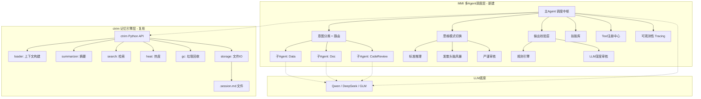

# ctrim 源码深度分析 + MMI 设计方案融合报告

> 基于 ctrim `feature/fusion-experiment` 分支完整源码审查，结合 MMI 修订版设计方案，输出可落地的融合方案。

---

# 一、ctrim 现状速览

## 1.1 项目定位

**C-Trim = 带记忆与上下文修剪的智能体主板（Agent Mainboard）**

核心设计原则：
- UI ≠ 推理 —— 界面只负责显示
- 显示 ≠ 发送 —— LLM 上下文是修剪过的视图
- 不压缩原文 —— 原文完整保存，只修剪 LLM 视图
- 轻量 + 开放 —— 主板只定义接口协议

## 1.2 当前完成度

| 维度 | 状态 |
|---|---|
| 代码行数 | ~5000+ 行 Python |
| 测试 | **351 个单元测试**，全部通过 |
| 阶段 | Phase 6 partial（P0 五项中四项完成） |
| 版本 | 0.5.0a5 |
| 包管理 | uv + pyproject.toml |
| 质量门禁 | mypy + ruff + pytest，每轮必过 |

---

# 二、ctrim 已实现模块 —— 逐模块评估

## 2.1 Session 会话系统 ⭐⭐⭐⭐⭐

**文件**: `ctrim/core/session.py`

| 特性 | 实现 | 评价 |
|---|---|---|
| ULID 时序ID | `str(ULID())` 26字符 Crockford Base32 | ✅ 生产级 |
| 四态状态机 | `SessionState`: active/warm/cold/zombie | ✅ 比 MMI 设计更先进 |
| Frontmatter | YAML + Markdown 互转，`SessionMeta` dataclass | ✅ 文件即数据库 |
| 时间处理 | UTC ISO-8601，`utcnow_iso()` | ✅ 时区安全 |

**对 MMI 的价值**: Session 系统是整个会话管理的基础。MMI 的"动态会话缓存"层可以直接用 ctrim 的 Session 模块作为数据层。

---

## 2.2 Heat 热度系统 ⭐⭐⭐⭐⭐

**文件**: `ctrim/core/heat.py`

```
公式: heat = access_count × 1.0 + recency_bonus - age_penalty
状态推导: heat ≥ 10 → active / ≥ 5 → warm / 其他 → cold / cold 持续 90 天 → zombie
```

| 特性 | 实现 |
|---|---|
| 阶梯式 recency bonus | 1天内+10, 7天+5, 30天+1 |
| 线性 age penalty | 每30天-1 |
| 批处理排序 | `sort_by_heat()` |

**这是 MMI 设计完全缺失的维度。** MMI 方案只说了"缓存"和"记忆"，但从未讨论会话如何老化、何时该被清理。ctrim 的热度系统可以直接作为 MMI 会话生命周期管理的基础设施。

---

## 2.3 Storage 存储层 ⭐⭐⭐⭐⭐

**文件**: `ctrim/core/storage.py`

| 特性 | 实现 |
|---|---|
| 原子写 | 写 `.tmp` → `os.replace()` rename 覆盖 |
| 文件锁 | portalocker 跨平台排他锁 |
| 追加模式 | `append_turn()` 始终追加，不重写历史 |
| Trash 机制 | 软删除，7天TTL后GC硬删除 |
| Turn 解析 | 正则解析 `**User:**` / `**Assistant:**` 配对 |

**生产级质量**。比 MMI 设计中的"会话缓存表（chat_cache）"用 MySQL 存 JSON 的方案更轻量、更可靠。文件即数据库，零运维。

---

## 2.4 Loader 上下文构建 ⭐⭐⭐⭐

**文件**: `ctrim/core/loader.py`

```
构建策略: system_prompt + summary(摘要) + hit_paragraphs(命中段) + recent_turns(最近N轮)
截断优先级: current_user > hits > recent > summary（不可丢弃）
Token 估算: 1 token ≈ 2 字符（保守值），硬上限 4000
```

**这比 MMI 的"首尾保留+中间压缩"更具体、更可操作。** MMI 方案只说了一个概念，ctrim 已经实现了三源合并+优先级截断的完整上下文构建算法。

**不足**: 纯字符数估算 token，不含 tiktoken 精准计数。这已在 PLAN.md Phase 2.3 规划中。

---

## 2.5 Summarizer 摘要系统 ⭐⭐⭐⭐

**文件**: `ctrim/core/summarizer.py`

| 特性 | 实现 |
|---|---|
| 触发条件(三选一) | ≥20轮 / ≥5000字符 / >24h且有≥5轮 |
| 版本链 | `summary_history` 保留历史摘要 |
| 后台线程 | `schedule_summary_update()` 非阻塞 |
| 双语 Prompt | 中英文独立 prompt 模板 |

**对 MMI 的启示**: MMI 的 L3"段落总结记忆"本质上就是摘要，但 ctrim 的摘要系统有触发策略、版本链、非阻塞执行，比 MMI 的静态摘要方案成熟得多。可以直接复用。

---

## 2.6 GC 垃圾回收 ⭐⭐⭐⭐

**文件**: `ctrim/core/gc.py`

| 特性 | 实现 |
|---|---|
| trash TTL | 7天自动清理 |
| zombie 清理 | state==zombie 直接删除 |
| cold 迁移 | cold 超期 → 移入 trash |
| dry_run | 预览模式，不实际删除 |
| 分层命令 | `gc --gc-only` 按cold/zombie/trash分层 |

**MMI 设计完全缺失的模块。** 任何长期运行的系统都需要垃圾回收，ctrim 已经做好了。

---

## 2.7 Search 检索 ⭐⭐⭐

**文件**: `ctrim/core/search.py`

| 特性 | 实现 |
|---|---|
| TF 评分 | 词频匹配 + 停用词过滤 |
| 中英分词 | 中文2-gram + 英文空格分词 |
| Fuzzy | rapidfuzz 模糊匹配（已下沉到core） |

**不足**: 纯 TF 字符串匹配，无向量检索。这是 ctrim 自身分析文档（ANALYSIS.md）也确认的短板。PLAN.md Phase 1.3 和 Phase 4.1 已规划升级到 FTS5 和向量检索。

---

## 2.8 TUI 终端界面 ⭐⭐⭐

**文件**: `ctrim/tui/`

基于 textual 框架，已实现：
- 聊天屏（流式输出）
- 列表屏（会话列表+快捷键）
- 搜索屏（实时 fuzzy 搜索）
- 斜杠命令菜单
- !bash / $python 绕过 LLM
- Ctrl+D 双击退出
- 多行编辑（TextArea）
- 思考/工具块 OMP 风格高亮

**对 MMI**: 这可以直接作为 MMI 的 TUI 接入端使用。

---

## 2.9 CLI 命令行 ⭐⭐⭐⭐

**文件**: `ctrim/cli.py`（31KB）

已实现 11+ 命令：`new / list / chat / archive / delete / gc / stat / export / tui / rename / info / inspect / doctor / update`

---

## 2.10 诊断与统计 ⭐⭐⭐⭐

**文件**: `ctrim/tools/doctor.py`

| 特性 | 实现 |
|---|---|
| 5项检查 | 模块导入/会话完整性/文件系统/Heat一致性/GC状态 |
| 三态输出 | [OK] / [WARN] / [FAIL] |
| 统计面板 | `ctrim stat`: 会话数/状态分布/总大小 |

---

# 三、ctrim vs MMI 设计 —— 逐模块对照

| MMI 模块 | ctrim 对应 | 成熟度 | 谁更好 | 融合建议 |
|---|---|---|---|---|
| 动态会话缓存 | loader.py + summarizer.py | ⭐⭐⭐⭐ | **ctrim** | 直接用 ctrim，MMI 的是概念描述 |
| 四级记忆系统 | search.py (TF) + 无向量 | ⭐⭐⭐ | — | ctrim 检索太弱，需升级为向量+摘要+原文三级 |
| 头脑风暴Agent | 无 | — | — | MMI 思维模式可加到 ctrim 的 chat 流程 |
| 审核Agent | 无 | — | — | MMI 分层校验可加到 ctrim 的输出管道 |
| 子Agent集群 | 无 | — | — | ctrim 完全缺少多Agent调度 |
| 技能库 | 无 | — | — | ctrim 需要从零建设 |
| Tool注册 | !bash/$python 硬编码 | ⭐⭐ | **MMI** | MMI 的 Tool注册中心设计更完整 |
| 会话生命周期 | heat.py + gc.py | ⭐⭐⭐⭐⭐ | **ctrim** | MMI 设计完全缺失，直接用 ctrim |
| 接入层 | CLI + TUI | ⭐⭐⭐⭐ | **ctrim** | ctrim 已有可用的 CLI 和 TUI |
| 可观测性 | doctor + stat | ⭐⭐⭐ | — | ctrim 有基础但缺 tracing 和评估框架 |

---

# 四、融合方案：ctrim + MMI = 完整智能体系统

## 4.1 核心思路

```
ctrim = 记忆与上下文引擎（成熟）
MMI   = 多Agent调度与技能管理（待建）

融合 = ctrim 做底层 → MMI 多Agent层调 ctrim 的 API
```

**关键决策**: 不要在 ctrim 内部加多Agent调度。保持 ctrim 的`核心可独立运行`原则。MMI 调度层作为 ctrim 的**上层消费者**，通过 ctrim 的 Python API 调用记忆/上下文/会话服务。

## 4.2 融合架构图



## 4.3 分层职责

| 层 | 职责 | 实现状态 |
|---|---|---|
| **MMI 调度层** | 意图分类、Agent路由、技能管理、输出校验、可观测性 | 待建 |
| **ctrim 记忆引擎层** | 会话存储、上下文构建、摘要、热度、GC、检索 | ✅ 已完成 80% |
| **LLM 底座** | 推理、生成、embedding | ✅ 已对接 |

---

# 五、具体融合路径 —— 比 MMI 修订版更进一步的方案

## 5.1 记忆系统：ctrim 升级 + MMI 接管

**当前 ctrim 有的**：文件存储 + TF检索 + 摘要 + 上下文构建  
**当前 ctrim 缺的**：向量检索 + 跨会话记忆注入

**方案**：

| 步骤 | 内容 | 在哪层 |
|---|---|---|
| 1 | ctrim 的 `search.py` 升级为 **SQLite FTS5 + embedding 向量双路检索** | ctrim 层 |
| 2 | 新增 `ctrim/core/memory.py`：记忆入库时自动生成 embedding + 结构化摘要 | ctrim 层 |
| 3 | 新增 `ctrim/core/retrieve.py`：检索 API，语义搜索 → top-10 → LLM 重排 → top-3 | ctrim 层 |
| 4 | MMI 主Agent在每次对话开始时调用 `ctrim.retrieve()` 注入上下文 | MMI 层 |

**这直接实现了 MMI 的三级记忆（向量语义 + 结构化摘要 + 原文存储），而且底层复用 ctrim 已有的存储设施。**

---

## 5.2 多Agent调度：全新建设

ctrim 完全没有多Agent概念。需要从零建设：

```
MMI 调度核心:
├── core/
│   ├── orchestrator.py    # 主Agent调度中枢
│   ├── router.py          # 意图分类 + 路由
│   ├── agent_registry.py  # Agent注册表
│   └── skill_library.py   # 技能库管理
├── agents/
│   ├── base.py            # BaseAgent 抽象类
│   ├── code_review.py     # 代码审查Agent
│   ├── doc.py             # 文档Agent
│   └── data.py            # 数据分析Agent
├── thinking/
│   └── modes.py           # 思维模式（标准/头脑风暴/审核）
├── validation/
│   ├── rules.py           # 规则引擎
│   └── deep_audit.py      # LLM深度审核
├── tools/
│   └── registry.py        # Tool注册中心
└── observability/
    ├── tracer.py          # 调用追踪
    └── evaluator.py       # 评估框架
```

**关键设计**: 每个 Agent 的 system prompt 中嵌入调用 ctrim 的指令：
```
你有权访问以下记忆系统：
- 当前会话上下文：通过 ctrim.loader.build_context(session_id) 获取
- 历史记忆：通过 ctrim.retrieve(query, user_id) 搜索
- 不要自己管理上下文，交给 ctrim
```

---

## 5.3 会话生命周期：直接继承 ctrim

MMI 设计完全没有会话生命周期管理。**直接继承 ctrim 的 heat + gc 系统**：

| ctrim 功能 | MMI 如何使用 |
|---|---|
| `heat.compute_heat()` | 每次对话后更新 MMI session 热度 |
| `heat.derive_state()` | 决定 MMI session 是 active/warm/cold/zombie |
| `gc.gc_all()` | 定时清理 MMI 的过期会话 |
| `storage.append_turn()` | MMI 每轮对话追加到 .session.md |

**这省掉了 MMI 自己设计会话管理的工作，ctrim 已经做好了。**

---

## 5.4 技能库：MMI 层建设，ctrim 提供存储

| 功能 | 实现位置 |
|---|---|
| Skill 数据结构定义 | MMI 层 |
| Skill CRUD API | MMI 层 |
| Skill 存储 | 可复用 ctrim 的 storage 模式（YAML frontmatter + .skill.md 文件） |
| Skill 使用统计 | MMI 层新增 |

---

## 5.5 可观测性：MMI 层新建 + ctrim 增强

| 功能 | 实现 |
|---|---|
| Agent 调用追踪 | MMI 层新建 `tracer.py` |
| Token 统计 | ctrim 已有 doctor/stat，增强为 MMI 的 `ctx-stats` |
| 评估框架 | MMI 层新建 50-100 测试用例 |
| 诊断 | ctrim 已有 `ctrim doctor`，MMI 加 `mmi doctor` |

---

# 六、融合后的整体系统全貌

```
┌─────────────────────────────────────────────────────────────┐
│                    接入层                                    │
│  Web GUI (Vue3)  │  CLI (Click)  │  TUI (ctrim textual)     │
├─────────────────────────────────────────────────────────────┤
│                 MMI 调度层（新建）                            │
│  ┌──────────┐  ┌──────────┐  ┌──────────┐  ┌─────────────┐ │
│  │ 主Agent  │  │ 意图路由 │  │ 思维模式 │  │ 输出校验层  │ │
│  │ 调度中枢 │  │ 分发器   │  │ 三模式    │  │ 规则+LLM    │ │
│  └──────────┘  └──────────┘  └──────────┘  └─────────────┘ │
│  ┌──────────┐  ┌──────────┐  ┌──────────┐  ┌─────────────┐ │
│  │ 技能库   │  │ Tool注册 │  │ 子Agent池│  │ 可观测性    │ │
│  │ 人工管理 │  │ 中心     │  │ 动态注册 │  │ Tracing     │ │
│  └──────────┘  └──────────┘  └──────────┘  └─────────────┘ │
├─────────────────────────────────────────────────────────────┤
│               ctrim 记忆引擎层（复用）                        │
│  ┌──────────┐  ┌──────────┐  ┌──────────┐  ┌─────────────┐ │
│  │ 向量检索 │  │ 上下文   │  │ 摘要     │  │ 会话存储    │ │
│  │ FTS5 +   │  │ 三源合并 │  │ 版本链   │  │ .session.md │ │
│  │ embedding│  │ 优先级截断│  │ 后台线程 │  │ 原子写+锁   │ │
│  └──────────┘  └──────────┘  └──────────┘  └─────────────┘ │
│  ┌──────────┐  ┌──────────┐  ┌──────────┐  ┌─────────────┐ │
│  │ 热度     │  │ GC回收  │  │ 标题生成 │  │ 杂项识别    │ │
│  │ 四态状态机│  │ 7天TTL  │  │ LLM+启发 │  │ 规则+LLM    │ │
│  └──────────┘  └──────────┘  └──────────┘  └─────────────┘ │
├─────────────────────────────────────────────────────────────┤
│                    LLM 底座                                  │
│          Qwen / DeepSeek / GLM / GPT 双模式                  │
└─────────────────────────────────────────────────────────────┘
```

---

# 七、分期落地规划（最终版）

## 一期：ctrim 增强 + MMI 最小闭环

**目标**: ctrim 补齐向量检索，MMI 跑通单一Agent对话

| 模块 | 工作内容 | 在哪层 |
|---|---|---|
| ctrim 检索升级 | search.py → SQLite FTS5 + embedding 向量双路检索 | ctrim |
| ctrim 记忆 API | 新增 `retrieve.py`：语义搜索→重排→top-3 | ctrim |
| MMI 主Agent | 单Agent对话，调用 ctrim API 获取上下文 | MMI |
| MMI Tool | 3-5个基础 Tool 注册 | MMI |
| Web GUI | Vue3 单页对话界面 | MMI |

**交付物**: 一个有向量记忆的单一Agent，Web界面可用。

---

## 二期：多Agent + 记忆完善

| 模块 | 工作内容 | 在哪层 |
|---|---|---|
| MMI Agent路由 | 意图分类 + 子Agent池 + 动态注册 | MMI |
| MMI 思维模式 | 标准/发散/审核三模式切换 | MMI |
| MMI 技能库 | 人工管理 prompt template | MMI |
| MMI 输出校验 | 规则引擎 | MMI |
| ctrim 摘要增强 | 结构化摘要（主题+决策+结论+待办） | ctrim |

**交付物**: 多Agent分工协作，有技能库和基础校验。

---

## 三期：进化 + 生态

| 模块 | 工作内容 |
|---|---|
| 技能统计 | 使用率/采纳率看板，候选技能提议 |
| LLM深度审核 | 高风险输出二次检查 |
| 评估框架 | 50-100 用例自动化评估 |
| 第三方对接 | Tool注册支持外部API |
| 性能优化 | 压测 + 调优 |

---

# 八、与原 MMI 修订方案的关键升级

| 维度 | 原 MMI 修订方案 | 融合 ctrim 后 |
|---|---|---|
| **记忆存储** | 需要从零设计存储层 | ✅ 直接复用 .session.md 文件+原子写+锁 |
| **上下文构建** | 只描述"首尾保留+中间压缩" | ✅ loader.py 三源合并+优先级截断已实现 |
| **会话生命周期** | 未涉及 | ✅ heat四态+GC自动回收已实现 |
| **摘要系统** | 静态摘要 | ✅ 触发策略+版本链+后台线程已实现 |
| **诊断能力** | 缺失 | ✅ ctrim doctor 5项检查已实现 |
| **测试基础** | 零 | ✅ 351个测试可直接扩展 |
| **CLI/TUI** | 需从零开发 | ✅ 11+ CLI命令 + TUI 已可用 |
| **多Agent调度** | 待建 | 待建（无变化） |
| **技能库** | 待建 | 待建（可复用 ctrim 文件存储模式） |
| **向量检索** | 待建 | 待建（但 ctrim 已有 search 基础+PLAN已规划） |

---

# 九、ctrim 源码中值得直接复用的代码资产

| 代码 | 位置 | 质量 | 复用方式 |
|---|---|---|---|
| `SessionMeta` dataclass | `session.py` | ⭐⭐⭐⭐⭐ | 直接 import |
| `compute_heat()` + `derive_state()` | `heat.py` | ⭐⭐⭐⭐⭐ | 直接 import |
| `build_context()` | `loader.py` | ⭐⭐⭐⭐ | 直接 import，后续增强 |
| `update_summary()` | `summarizer.py` | ⭐⭐⭐⭐ | 直接 import |
| `gc_all()` | `gc.py` | ⭐⭐⭐⭐ | 直接 import |
| `search_top_k()` | `search.py` | ⭐⭐⭐ | 作为 baseline，升级为向量 |
| `_atomic_write()` + 文件锁 | `storage.py` | ⭐⭐⭐⭐⭐ | 直接 import |
| `t()` i18n 函数 | `i18n.py` | ⭐⭐⭐⭐ | 直接 import |
| `ctrim doctor` | `tools/doctor.py` | ⭐⭐⭐⭐ | 直接 import |
| `classify_session()` | `classifier.py` | ⭐⭐⭐ | 作为意图分类的参考实现 |

---

# 十、风险与注意事项

| 风险 | 说明 | 缓解 |
|---|---|---|
| ctrim 耦合风险 | MMI 层过度依赖 ctrim 内部实现 | MMI 只调 ctrim 的公开 API，不进内部 |
| 两套代码维护 | ctrim + MMI 两个代码库 | 初期可同仓库不同包，后期考虑合并 |
| 文件存储性能 | .session.md 大了后 IO 变慢 | SQLite FTS5 索引 + embedding 分离存储 |
| ctrim 无 streaming context | loader 当前是同步的 | MMI 层做异步包装 |

---

# 十一、总结

**ctrim 不是一个"半成品"，而是一个质量相当高的记忆引擎底座。** 它的 Session、Heat、Loader、Summarizer、GC、Storage 模块都是生产级的。它的主要短板（向量检索、多Agent调度、技能管理）恰好是 MMI 设计要补充的。

**最优策略**：
1. ctrim 作为底层库，补齐向量检索（FTS5 + embedding）
2. MMI 调度层作为上层应用，import ctrim 做记忆/上下文/会话管理
3. 两套代码独立演进，ctrim 保持"主板"定位，MMI 做"调度"

**省掉的工作量**：会话存储、上下文构建、摘要、热度、GC、诊断、CLI、TUI、i18n 全部不需要从零写——ctrim 已经做好了。MMI 团队可以**聚焦在多Agent调度、技能管理和输出校验这三个 ctrim 完全缺失的领域**。

---

> 生成时间：2026-06-03
> 基于：ctrim feature/fusion-experiment 分支全量源码审查 + MMI 修订版设计方案
